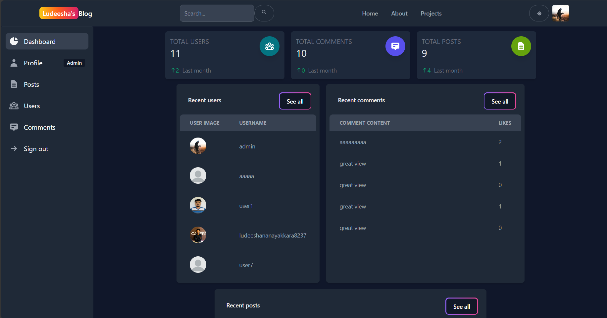
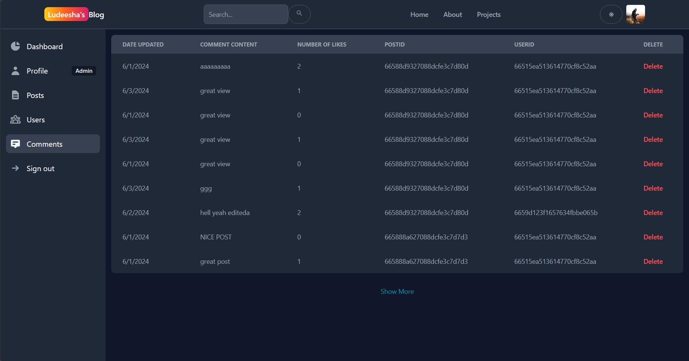
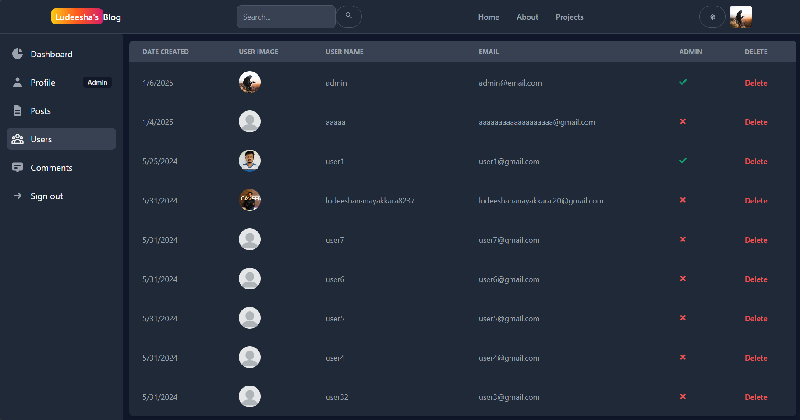
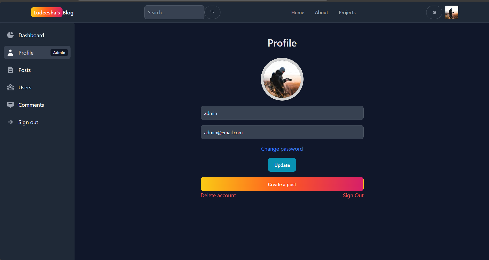
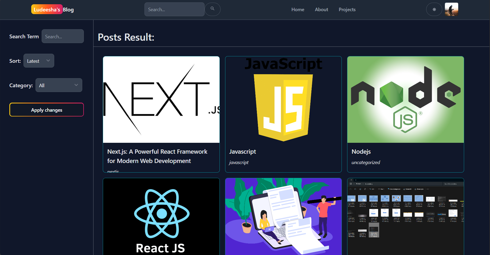
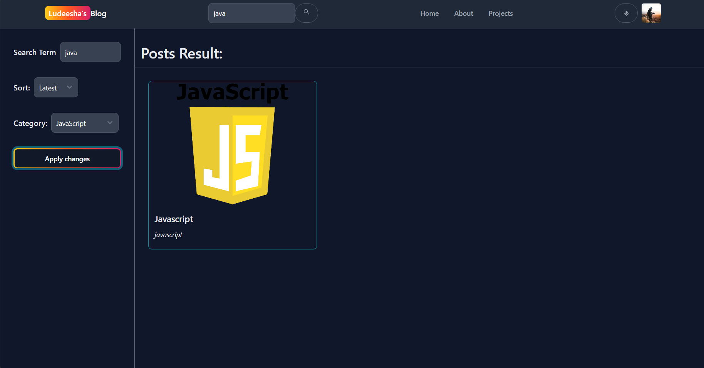

# Ludeesha's Blog

Ludeesha's Blog is a dynamic content management platform designed to facilitate seamless content creation and user interaction. The platform offers two distinct roles: Admins and Users, each with tailored functionalities to enhance usability and management efficiency.

## Features for Admins:
Content Management: Create, edit, and delete posts to keep the content fresh and relevant.
User Management: Access a comprehensive list of users and manage admin roles effectively.
Analytics: Analyze website performance and user engagement metrics to make data-driven decisions.

## Features for Users:
Content Exploration: Search for and read engaging articles across various topics.
Interactive Engagement: Like and comment on articles, fostering an active and vibrant community.

With its intuitive interface and robust feature set, Ludeesha's Blog empowers admins to streamline content delivery while enabling users to explore and interact with rich, engaging content. Whether you're managing the platform or enjoying its content, Ludeesha's Blog is designed to deliver a seamless and interactive experience.

## Link to the demo
[Ludeesha's Blog](https://blog-app-axl1.onrender.com/)

<!-- Insert the photos from public folder here -->
## Screenshots

### Admin Dashboard page

### Admin Comments

### Admin Users

### User Profile

### Post Management

### View Posts

### Search posts

